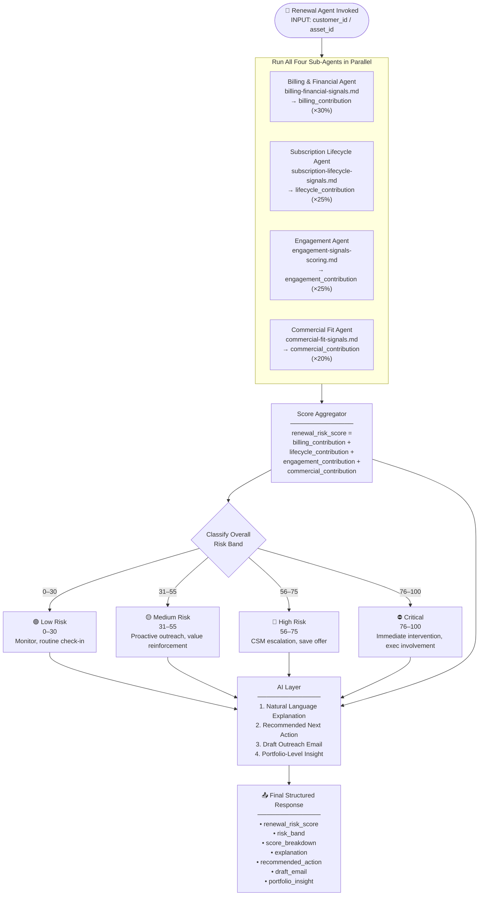
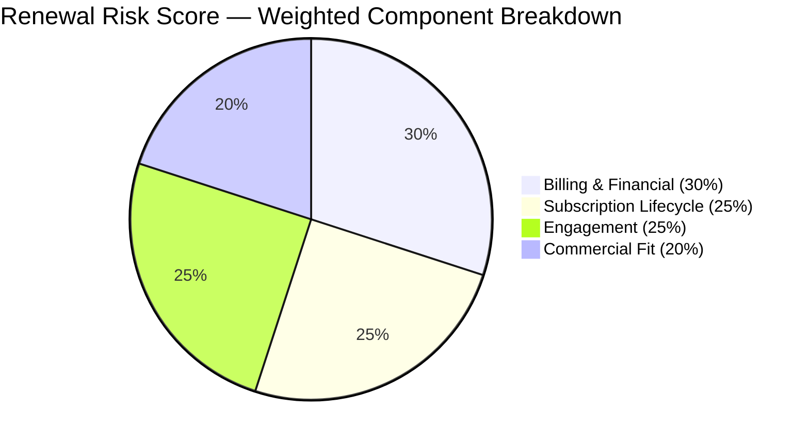
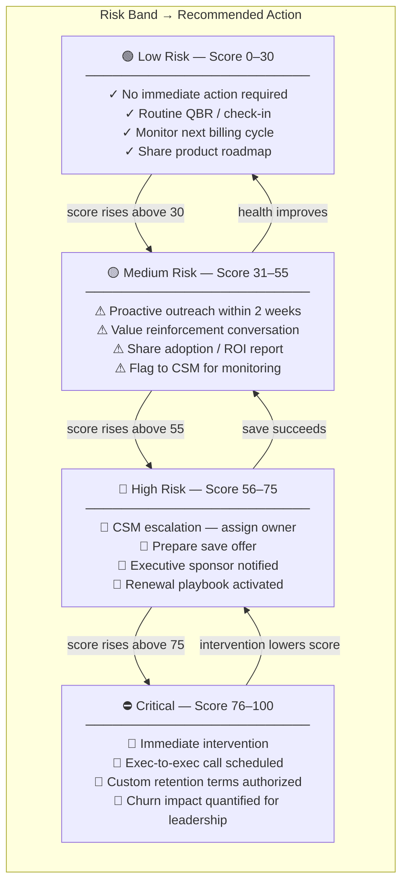

# Renewal Risk Score Aggregator & AI Layer
## Agent Reference Document for Renewal Risk Scoring

---

## 1. Purpose

This document defines the **master orchestration layer** of the Renewal Risk Scoring model.
The Agent must:
1. Collect the four weighted sub-scores from the component agents
2. Compute the final `renewal_risk_score` (0–100)
3. Classify the overall Risk Band
4. Invoke the AI Layer to produce natural language outputs
5. Return a single structured response with scores, explanations, recommended actions, and a draft outreach email

**This document is read AFTER all four component documents have been processed:**
- `billing-financial-signals.md` → `billing_contribution` (30%)
- `subscription-lifecycle-signals.md` → `lifecycle_contribution` (25%)
- `engagement-signals-scoring.md` → `engagement_contribution` (25%)
- `commercial-fit-signals.md` → `commercial_contribution` (20%)

---

## 2. Overall Score Formula

```
renewal_risk_score =
    billing_health_score         × 0.30  +
    subscription_lifecycle_score × 0.25  +
    engagement_score             × 0.25  +
    commercial_fit_score         × 0.20
```

All four sub-scores are on a 0–100 scale. The resulting `renewal_risk_score` is also 0–100.

**Higher score = higher churn risk.**

---

## 2a. System Architecture

### 2a.1 — Master Orchestration Flow



---

### 2a.2 — Score Composition Visual



---

### 2a.3 — Risk Band to Action Matrix



---

## 3. Risk Band Definitions

| Score | Band | Color | Recommended Cadence | Escalation |
|---|---|---|---|---|
| 0–30 | Low Risk | 🟢 Green | Monthly automated check-in | None |
| 31–55 | Medium Risk | 🟡 Yellow | Bi-weekly CSM outreach | CSM awareness |
| 56–75 | High Risk | 🔴 Red | Weekly CSM + AE alignment | CSM + AE assigned |
| 76–100 | Critical | ⛔ Dark Red | Daily exec tracking | CSM + AE + Exec sponsor |

---

## 4. The AI Layer

The AI Layer runs after the numeric score is computed. It produces four outputs per asset:

### 4.1 Natural Language Explanation

**Purpose:** Don't just show a number — explain WHY the asset is at risk in plain English.

**Rules:**
- Reference the top 2–3 highest-contributing signals by name
- Use specific data from the `raw_signals` fields (not generic language)
- Keep the explanation to 2–4 sentences
- Avoid jargon; write as if briefing a CSM who does not read spreadsheets

**Template:**
```
This asset scores {renewal_risk_score}/100 ({risk_band}).
The highest-risk signals are: {top_signal_1} ({points} pts) and {top_signal_2} ({points} pts).
{Specific data observation — e.g., "The last invoice was 45 days overdue and there were 3 payment failures in the past 90 days."}
{Context sentence — e.g., "This is a monthly contract that has not renewed in 14 months, which increases churn likelihood."}
```

**Example output:**
> "This asset scores 72/100 (High Risk). The dominant risk signals are billing health (overdue invoice 45 days, 3 payment failures in 90 days) and engagement decline (no user logins in 38 days, NPS score of 4). The account is on a monthly contract with no prior renewal history, and license utilization has dropped to 32%."

---

### 4.2 Recommended Next Action

**Purpose:** Give the CSM or renewal manager a single, specific, prioritized action to take — not a menu.

**Action Selection Logic (applied in order):**

| Condition | Recommended Action |
|---|---|
| `risk_band = Critical` AND billing signals dominate | "Initiate exec-to-exec call and prepare custom payment plan. Escalate to VP CS." |
| `risk_band = Critical` AND engagement signals dominate | "Schedule immediate product success review with champion. Offer dedicated CSM office hours." |
| `risk_band = High Risk` AND renewal within 30 days | "Activate save playbook immediately. Prepare renewal offer with right-size option." |
| `risk_band = High Risk` AND renewal > 30 days | "CSM to schedule value review call within 5 business days. Prepare ROI summary." |
| `risk_band = Medium Risk` AND NPS < 7 | "Send NPS follow-up email with specific action plan addressing stated pain points." |
| `risk_band = Medium Risk` AND low adoption | "Trigger product adoption email sequence. Offer CSM-led training session." |
| `risk_band = Low Risk` | "No immediate action. Add to monthly CSM review queue. Monitor next billing cycle." |

---

### 4.3 Draft Outreach Email

**Purpose:** One click → a personalized renewal email the CSM can review, edit, and send.

**Email generation rules:**
- Use the account name, CSM name (if available), and specific signal data
- Never mention the numeric risk score in the email
- Frame from a position of partnership, not alarm
- Include one specific reference to the customer's product/use case
- Include a clear, low-friction call to action (30-minute call, not a long form)
- Adjust tone by risk band:
  - Low / Medium: warm, value-forward
  - High: concerned, urgent but not alarming
  - Critical: executive-level, direct

**Draft Email Template:**
```
Subject: {Account Name} — Checking in ahead of your renewal

Hi {Contact First Name},

I wanted to reach out personally ahead of your renewal on {Renewal Date}.

{Value statement — e.g., "Our team has loved supporting [Account Name] and we want to make sure you're getting the most out of [Product]."}

{Specific observation — e.g., "I noticed usage has been lighter than usual over the past few weeks — I'd love to understand if there's anything we can do to help."}

Would you have 30 minutes for a quick call this week? I can share some ideas on how other {Industry/Tier} customers are getting value from {Feature Area}.

{Optional: "I've also asked our team to prepare a right-size option for your review."}

Best,
{CSM Name}
{Title}
{Email / Calendar Link}
```

---

### 4.4 Portfolio-Level Insight

**Purpose:** Give CS leadership a portfolio-wide view — not just one asset.

**Computed when the Agent is invoked in bulk mode (multiple assets):**

```
portfolio_insight = {
  "total_assets_analyzed": N,
  "assets_by_band": {
    "low_risk": count,
    "medium_risk": count,
    "high_risk": count,
    "critical": count
  },
  "arr_at_risk": {
    "high_risk_arr": sum of TotalARR where risk_band = High Risk,
    "critical_arr": sum of TotalARR where risk_band = Critical,
    "total_at_risk_arr": high_risk_arr + critical_arr
  },
  "estimated_retention": {
    "without_intervention_pct": historical_save_rate_without_action,
    "with_intervention_pct": historical_save_rate_with_action,
    "estimated_arr_saved": total_at_risk_arr × (with - without)
  },
  "top_risk_drivers": [
    "Billing overdue > 30 days (affects N assets)",
    "No user login in 30+ days (affects N assets)",
    "NPS Detractor score (affects N assets)"
  ],
  "renewal_calendar": [
    { "window": "Next 30 days", "count": N, "arr": sum },
    { "window": "31–60 days", "count": N, "arr": sum },
    { "window": "61–90 days", "count": N, "arr": sum }
  ]
}
```

**Example portfolio insight narrative:**
> "You have $127,000 of ARR at High or Critical risk renewing in the next 30 days across 14 assets. Based on historical save rates for similar profiles, you can expect to retain ~65% ($82,550) without intervention. With proactive outreach on all High/Critical assets, modeled retention rises to ~82% ($104,140) — a potential $21,590 improvement. The top shared risk driver is billing overdue > 30 days, affecting 9 of the 14 assets."

---

## 5. Final Structured JSON Output

The master agent must return the following complete JSON for each asset:

```json
{
  "asset_id": "ASSET-00456",
  "account_id": "ACC-00123",
  "account_name": "Acme Corp",
  "renewal_date": "2026-07-15",
  "acv": 34200.00,

  "renewal_risk_score": 67,
  "risk_band": "High Risk",

  "score_breakdown": {
    "billing_health_score": 55,
    "billing_contribution": 16.5,
    "subscription_lifecycle_score": 70,
    "lifecycle_contribution": 17.5,
    "engagement_score": 62,
    "engagement_contribution": 15.5,
    "commercial_fit_score": 88,
    "commercial_contribution": 17.6
  },

  "top_risk_signals": [
    { "signal": "License Utilization 32%", "component": "commercial", "points": 30 },
    { "signal": "Last Renewal Negotiated", "component": "lifecycle", "points": 25 },
    { "signal": "No Login in 38 Days", "component": "engagement", "points": 25 }
  ],

  "ai_layer": {
    "explanation": "This asset scores 67/100 (High Risk). The dominant risk signals are commercial (license utilization dropped to 32%, renewal in 47 days) and subscription lifecycle (last renewal required negotiation and was 22 days late). Engagement has also declined — no user logins in 38 days and NPS score of 5.",
    "recommended_action": "CSM to schedule value review call within 5 business days. Prepare right-size renewal option and ROI summary ahead of the July 15 renewal.",
    "draft_email": {
      "subject": "Acme Corp — Checking in ahead of your July renewal",
      "body": "Hi Sarah,\n\nI wanted to reach out personally ahead of your renewal coming up on July 15...\n\n[Full email body generated here]\n\nBest,\nJordan Lee\nCustomer Success Manager"
    }
  }
}
```

---

## 6. Configurable Score Weights

The four component weights are configurable. The default configuration is:

| Component | Default Weight | Min | Max |
|---|---|---|---|
| `billing_health_score` | 30% | 10% | 50% |
| `subscription_lifecycle_score` | 25% | 10% | 40% |
| `engagement_score` | 25% | 10% | 40% |
| `commercial_fit_score` | 20% | 10% | 40% |

**Constraint:** All four weights must sum to exactly 100%.

If a user or admin modifies the weights, the Agent must:
1. Validate that the four weights sum to 100
2. Re-compute `renewal_risk_score` using the updated weights
3. Note the weight configuration used in the response JSON under `"weight_config"`

**Default weight configuration object:**
```json
{
  "weight_config": {
    "billing": 0.30,
    "lifecycle": 0.25,
    "engagement": 0.25,
    "commercial": 0.20,
    "is_default": true
  }
}
```

---

## 7. Assets Grid — Column Derivation

The file `Data/assets_grid.csv` powers the portfolio renewal grid UI. All columns except `risk_band` and `recommended_actions_count` are sourced directly from the platform data. Those two columns are populated exclusively by this agent after scoring is complete.

### Column Sources

| Grid Column | Source | Derivation |
|---|---|---|
| `asset_id` | `Data/asset_line_items.csv` | `asset_line_item_id` |
| `asset_name` | `Data/asset_line_items.csv` | Display label |
| `company` | `Data/customers.csv` | `name` |
| `price_monthly` | `Data/subscriptions.csv` | `total_arr / 12` (MRR) |
| `term_months` | `Data/asset_line_items.csv` | `selling_term` |
| `expires_in_days` | `Data/subscriptions.csv` | `DATEDIFF(renewal_date, CURRENT_DATE)` |
| `expires_date` | `Data/subscriptions.csv` | `renewal_date` |
| `due_amount` | `Data/invoices.csv` | `total_amount` WHERE `due_past_by > 0` AND `paid_at IS NULL`; else `0` |
| `base_tcv` | `Data/asset_line_items.csv` | `tcv` |
| `grr_pct` | `Data/asset_transaction_history.csv` | `(original_arr - downgrade_arr_loss) / original_arr × 100` |
| `nrr_pct` | `Data/asset_transaction_history.csv` | `(original_arr - downgrade_arr_loss + upgrade_arr_gain) / original_arr × 100` |
| `renewal_amount` | Computed | `current_arr × (nrr_pct / 100)` — estimated renewal value |
| `upsell_opp_amount` | Computed | Based on license headroom and usage growth trend |
| `risk_band` | **⚡ RENEWAL RISK AGENT** | Output of `renewal_risk_score` → Risk Band classification |
| `recommended_actions_count` | **⚡ RENEWAL RISK AGENT** | Count of distinct recommended actions from AI Layer |

### GRR / NRR Computation Queries

```sql
-- GRR: gross retention (downgrades only, no expansions, capped at 100%)
SELECT
    account_id,
    ROUND(
        LEAST(100,
            (current_arr / NULLIF(current_arr - net_downgrade_arr, 0)) * 100
        ), 1
    ) AS grr_pct
FROM (
    SELECT
        customer_id AS account_id,
        SUM(change_in_asset_arr) FILTER (WHERE action = 'Downgrade') AS net_downgrade_arr,
        MAX(arr) AS current_arr
    FROM asset_transaction_history
    JOIN asset_line_items USING (subscription_id)
    WHERE transaction_date >= NOW() - INTERVAL '12 months'
    GROUP BY customer_id
) t;

-- NRR: net retention (downgrades + upgrades)
SELECT
    account_id,
    ROUND(
        ((current_arr + upgrade_arr - ABS(downgrade_arr)) /
         NULLIF(current_arr - upgrade_arr + ABS(downgrade_arr), 0)) * 100
    , 1) AS nrr_pct
FROM (
    SELECT
        customer_id AS account_id,
        SUM(change_in_asset_arr) FILTER (WHERE action = 'Upgrade') AS upgrade_arr,
        SUM(change_in_asset_arr) FILTER (WHERE action = 'Downgrade') AS downgrade_arr,
        MAX(arr) AS current_arr
    FROM asset_transaction_history
    JOIN asset_line_items USING (subscription_id)
    WHERE transaction_date >= NOW() - INTERVAL '12 months'
    GROUP BY customer_id
) t;
```

### Agent Write-Back

After scoring each asset, the agent writes the two derived columns back to `assets_grid.csv`:

```
risk_band              → "Low Risk" | "Medium Risk" | "High Risk" | "Critical"
recommended_actions_count → integer (1, 2, or 3 based on risk band and signal severity)
```

The `recommended_actions_count` maps to the number of action icons shown in the UI:
- 1 action → Low / Medium Risk (monitor or standard outreach)
- 2 actions → High Risk (CSM outreach + save offer)
- 3 actions → Critical (exec call + custom terms + immediate CSM escalation)
